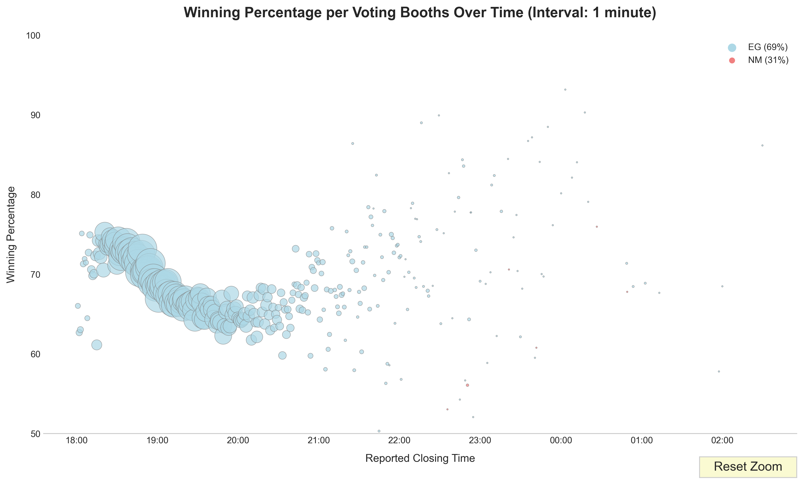

[Read in English](/README.md)

# Extracción de Marcas de Tiempo con OCR de Actas de Votación

⭐ Danos una estrella en GitHub - ¡Apoya nuestra investigación!

## Introducción

Este proyecto comenzó como una excusa para probar las capacidades de generación de código de [Cursor AI](https://www.cursor.com/) y sus aplicaciones para la manipulación, preparación y análisis de datos.

Este proyecto consta de varios componentes, cada uno realizando una función muy específica para resolver un paso particular del proceso. Es muy especializado y posiblemente no directamente aplicable a diferentes necesidades, pero destaca la amplia gama de posibilidades de los generadores de código AI cuando se trata de problemas de datos no estándar.

Me complació particularmente la facilidad con la que pude crear nuevas herramientas, adaptarlas a los problemas encontrados en el camino y ahorrar miles de horas de trabajo tedioso.

Una vez que los datos fueron limpiados, pude usar la interfaz de Cursor AI como un generador de gráficos en lenguaje natural. Simplemente pedí la visualización que necesitaba y se me proporcionó el código. Puedes usar esto como una herramienta para generar una biblioteca base de gráficos que luego puedes modificar o adaptar como desees.

## Motivación

## Descripción

Este proyecto está diseñado para extraer marcas de tiempo de una serie de imágenes utilizando Reconocimiento Óptico de Caracteres (OCR). Procesa un archivo CSV que contiene URLs de imágenes, descarga las imágenes, realiza OCR para extraer las marcas de tiempo y actualiza el CSV con los resultados. El script incluye características como la rotación de imágenes para mejorar la detección de marcas de tiempo y el manejo eficiente de archivos previamente procesados. Herramientas adicionales permiten la validación de resultados por parte del usuario y la visualización de datos.

## get-images.py

`get-images.py` se utiliza para descargar las imágenes de las actas del servidor de [ResultadosConVzla](https://resultadosconvzla.com/). Utiliza hilos y retrasos para descargar eficientemente todos los datos sin sobrecargar el servidor. Las imágenes también se pueden descargar del sitio web de [Macedonia del Norte](https://macedoniadelnorte.com).

## ocr-time.py

`ocr-time.py` utiliza la herramienta [Tesseract-OCR](https://github.com/UB-Mannheim/tesseract/wiki) para extraer marcas de tiempo de los archivos de imagen de las actas de votación.

Se utiliza un cuadro delimitador para limitar el OCR a un área particular de la imagen. Si no se detecta una marca de tiempo, se amplía el cuadro delimitador. La imagen también se rota 180 grados (porque se descubrió que muchas de las imágenes estaban al revés).

```
Conversación real con Cursor AI (original en inglés):

Ok. He descargado todos los archivos de imagen. Me gustaría realizar OCR en una porción de cada imagen y extraer una marca de tiempo. ¿Qué sugieres?
```

### Características

- Extrae marcas de tiempo de imágenes usando OCR
- Maneja grandes conjuntos de datos eficientemente
- Reanuda el procesamiento interrumpido
- Rota las imágenes si las marcas de tiempo no se detectan inicialmente
- Elimina entradas duplicadas en el CSV de salida
- Guarda imágenes rotadas para análisis adicional

## count-nf.py / move-nf-images.py

`count-nf.py` y `move-nf-images.py` son herramientas únicas para determinar qué imágenes de actas no tenían una marca de tiempo (por lo tanto, marcadas como `NF` para No Encontrado). Esto nos da una visión rápida de qué imágenes tienen problemas. Descubrí que varias imágenes estaban de lado (y simplemente necesitaban una rotación de 90 grados). Otras imágenes tenían pliegues o manchas que hacían que las marcas de tiempo fueran difíciles de reconocer o inexistentes.

## validate-ocr.py

Me sorprendió realmente `validate-ocr.py` ya que no esperaba que Cursor AI creara algo tan bueno tan rápidamente.

Esta herramienta carga la base de datos de marcas de tiempo y te permite hacer clic en cada fila y abrir la imagen del acta debajo. Luego puedes hacer zoom y desplazarte hasta que encuentres la marca de tiempo, seleccionarla con el mouse y extraerla con OCR. Luego escribe la nueva marca de tiempo en la base de datos. Esta herramienta también fue muy útil para limpiar problemas de OCR.

```
Conversación real con AI para crear esta herramienta (original en inglés):

Ok. Ahora que tenemos la mayoría de nuestras imágenes correctamente procesadas con OCR, construyamos una herramienta para ayudarnos a validar el resto. Esto es lo que necesito:

La herramienta debe mostrar tanto el archivo CSV como el archivo de imagen correspondiente a la fila activa. El usuario debe poder editar la fila activa en caso de que haya un error en la marca de tiempo del OCR. Idealmente, el CSV ('resultados-with-timestamps.csv') se mostraría en la parte superior y la imagen se abriría en la parte inferior (o en el lado derecho). El visor de imágenes debe permitir acercar y alejar la imagen. Idealmente, el nivel de zoom y el desplazamiento persistirían entre diferentes imágenes (ya que los datos que estamos validando están casi siempre en la misma región).
```

## Herramientas de gráficos

Hice un montón de herramientas de gráficos sobre la marcha, para mirar los datos rápidamente desde diferentes ángulos. Este enfoque hace que sea muy fácil probar nuevas ideas y realmente enfocarse en los gráficos necesarios, sin perder demasiado tiempo manipulando datos y aprendiendo bibliotecas de gráficos. Eventualmente pondré todo esto junto en una herramienta, con mejores visuales y UI. Pero por ahora, son un gran conjunto de herramientas para armar un informe. Un Jupyter Notebook podría ser una buena solución.



- `chart-time-vote.py`
- `chart-time-vote-cumulative.py`
- `chart-time-vote-15-minute-votes.py`
- `chart-time-vote_old.py`
- `chart-time-vote-10-minute-diff.py`
- `chart-time-vote-10-minute-diff-pct.py`
- `chart-time-mesa-scatter.py`
- `chart-time-second-distribution.py`

### Ejemplo de conversación con la IA para generar gráficos

```
1. Ok. Ahora queremos graficar algunos resultados de los datos que hemos preparado. Lee el archivo resultados-with-timestamps.csv, usa la columna de marca de tiempo para tu eje X. Usa los dos primeros dígitos para la hora y el segundo par de dígitos para los minutos. Descarta el resto del campo. En cada hora:minuto, grafica los valores para las siguientes columnas: NM en rojo, y EG en azul.

2. Ok. Hagamos algunos cambios. Solo grafica las marcas de tiempo entre las 6:00 y las 12:00.

3. Grafiquemos la diferencia en valor entre EG y NM

4. ok, oculta los valores individuales de EG y NM por ahora. Concentrémonos solo en el delta

5. ok. Me gustaría poder hacer zoom en áreas del gráfico (y volver a alejar también)

6. ok, gracias. Ahora probemos la siguiente visualización. Grafica los valores de EG como positivos y los valores de NM como negativos. Grafica los valores acumulativos a lo largo del tiempo.

7. Agreguemos una línea adicional, usando el eje y derecho, para representar el número acumulativo de filas procesadas a través del tiempo. Esto nos dará una idea de cuántos centros de votación habían cerrado en un momento dado.

8. Ok. Ahora quiero saber la siguiente información. Quiero graficar el porcentaje del total de votos que cada candidato recibió por intervalo de 15 minutos. Usa el total de cada candidato para calcular su porcentaje.

9. ¿Puedes aplicar las mejores prácticas de diseño para que este gráfico se vea mejor?

10. ok. Ahora modifiquemos este archivo (chart-time-second-distribution.py) para realizar un tipo diferente de análisis. Me gustaría ver un gráfico que muestre el número total de mesas que reportaron en un momento particular. Entonces, si dos mesas reportaron a las 06:21:18, el punto de datos en ese momento sería 2. ¿Entiendes?

11. ok. Ahora agrupemos las mesas por el "segundo" en que cerraron. Quiero saber cuántas mesas cerraron a los :00, cuántas a los :01 segundos, etc... independientemente de la hora o el minuto.
```

Si encontraba algún error, se lo hacía saber a Cursor y lo arreglaba. Si quería más gráficos, diferentes colores, otros puntos de datos, todo lo que tenía que hacer era preguntar. A veces, la IA respondía con alguna idea sobre los datos que quería analizar y cómo este enfoque funcionaría para eso (sin embargo, no ofrecía alternativas ni críticas, aunque tampoco se las pedí).

## Requisitos

- Python 3.6+
- Tesseract OCR
- Bibliotecas de Python: PIL (Pillow), pytesseract, requests

También necesitarás el archivo CSV de [Macedonia del Norte](https://macedoniadelnorte.com). Este proyecto incluye una [versión](data/resultados-with-timestamps.csv) revisada que incluye las marcas de tiempo.

## Instalación

1. Clona este repositorio:
   ```bash
   git clone https://github.com/yourusername/elecciones2024-timestamp.git
   cd elecciones2024-timestamp
   ```

2. Instala las bibliotecas de Python requeridas:
   ```bash
   pip install -r requirements.txt
   ```

3. Instala Tesseract OCR:
   - Para Windows: Descarga e instala desde [GitHub Tesseract-OCR](https://github.com/UB-Mannheim/tesseract/wiki)
   - Para macOS: `brew install tesseract`
   - Para Linux: `sudo apt-get install tesseract-ocr`

4. Establece la ruta al ejecutable de Tesseract en el script si no está en tu PATH del sistema.

## Uso

1. Prepara tu archivo CSV de entrada (por ejemplo, `resultados-macedonia-del-norte.csv`) con al menos una columna 'URL' que contenga URLs de imágenes.

2. Actualiza el script con tus rutas de archivo y configuraciones específicas:
   - `input_csv`: Ruta a tu archivo CSV de entrada
   - `output_csv`: Ruta para el archivo CSV de salida
   - `image_dir`: Directorio donde se almacenan las imágenes descargadas

3. Ejecuta los scripts.
   - Primero ejecuta `get-images.py` o descarga las imágenes de uno de los servidores disponibles.
   - Luego ejecuta `ocr-time.py` para realizar el OCR.
   - Sin embargo, como ya he hecho esto, es posible que quieras simplemente usar `validate-ocr.py` para ayudar a validar las marcas de tiempo y proporcionar tus ediciones a través de PR.

4. El script procesará las imágenes y actualizará el archivo CSV de salida con las marcas de tiempo extraídas.

## Salida

- Archivo CSV actualizado con una nueva columna 'timestamp'
- Imágenes rotadas (si las hay) guardadas con el sufijo '_rotated' en el directorio de imágenes

## Solución de problemas

- Si no se encuentra Tesseract, asegúrate de que esté instalado y que la ruta esté correctamente establecida en el script.
- Para problemas con el procesamiento de imágenes, verifica los permisos del directorio de imágenes y el espacio en disco disponible.

## Contribuciones

Las contribuciones para mejorar el script o extender su funcionalidad son bienvenidas. Por favor, envía un pull request o abre un issue para discutir los cambios propuestos.

## Contacto

Para cualquier consulta o soporte, por favor abre un issue en el repositorio de GitHub o contacta a través de [X](https://x.com/cgranier)
