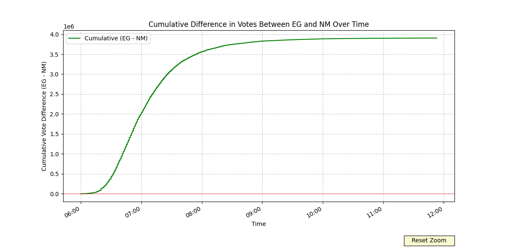

[Léeme en español](/LEEME.md)

# Timestamp Extraction with OCR from Voter Tally Sheets

## Introduction

This project began as an excuse to test the code-generation capabilities of [Cursor AI](https://www.cursor.com/) and its applications for data-wrangling, preparation and analysis.

This project consists of several components, each performing a very specific function to solve a particular step of the process. It is very specialized and possibly not directly applicable to different needs - but it highlights the wide range of possibilities of AI code generators when dealing with non-standard data problems.

I was particularly pleased with the ease with which I could create new tools, adapt them to problems encountered along the way and save thousands of hours of tedious work.

Once the data was cleaned up, I was able to use the Cursor AI interface as a natural language chart generator. I simply asked for the visualization I needed and the code was provided. You can use this as a tool to generate a base library of charts that you can then modify or adapt as you wish.

## Motivation


## Description

This project is designed to extract timestamps from a series of images using Optical Character Recognition (OCR). It processes a CSV file containing image URLs, downloads the images, performs OCR to extract timestamps, and updates the CSV with the results. The script includes features such as image rotation for improved timestamp detection and efficient handling of previously processed files. Additional tools allow for user validation of results and data visualization.

## get-images.py

`get-images.py` is used to download the tally images from the [ResultadosConVzla](https://resultadosconvzla.com/) server. It uses threading and delays to efficiently download all data without taxing the server. The images can also be downloaded from the [Macedonia del Norte](macedoniadelnorte.com) website.

## ocr-time.py

`ocr-time.py` uses the [Tesseract-OCR](https://github.com/UB-Mannheim/tesseract/wiki) tool to extract timestamps from the voting machine tally image files.

A bounding box is used to limit the OCR to a particular area of the image. If no timestamp is detected, the bounding box is enlarged. The image is also rotated 180 degrees (because a lot of the images where found to be upside down).

```
Actual conversation with Cursor AI:

Ok. I've downloaded all the image files. I would like to perform OCR in a portion of each image and extract a time stamp. What do you suggest?
```

### Features

- Extracts timestamps from images using OCR
- Handles large datasets efficiently
- Resumes interrupted processing
- Rotates images if timestamps are not initially detected
- Deduplicates entries in the output CSV
- Saves rotated images for further analysis

## count-nf.py / move-nf-images.py

`count-nf.py` and `move-nf-images.py` are one-of tools to determine which tally images did not have a timestamp (thus marked `NF` for Not Found). This gives us a quick overview of which images have issues. I found that several images where sideways (and simply needed a 90 degree rotation). Other images had folds or smudges that made the timestamps hard to recognize or inexistent.

## validate-ocr.py

I was really surprised with `validate-ocr.py` as I didn't expect Cursor AI to come up with something so good so quickly.

This tool loads the database of timestamps and lets you click on each row and open the tally image below. You can then zoom and pan around until you find the timestamp, select it with your mouse and extract it with OCR. It then writes the new timestamp to the database. This tool was also very useful for cleaning up OCR issues.

```
Actual conversation with AI to create this tool

Ok. Now that we have most of our images properly OCR'ed, let's build a tool to help us validate the rest. Here's what I need:

The tool should display both the CSV file and the image file corresponding to the active row. The user should be able to edit the active row in case there is an error in the OCR timestamp. Ideally the CSV ('resultados-with-timestamps.csv') would be displayed across the top and the image would open on the bottom (or to the right side). The image viewport should allow for zoom in and out of the image. Ideally, the zoom level and panning would persist between different images (since the data we're validating is almost always in the same region).
```

## Charting tools

I made a bunch of charting tools on the fly, to look at the data quickly from different angles. This approach makes it very easy to test new ideas and really focus on the necessary charts, without wasting too much time massaging data and learning charting libraries. I will eventually put all this together into one tool, with better visuals and UI. But for now, they are a great set of tools for putting together a report. A Jupyter Notebook might be a good solution.

- `chart-time-vote.py`
- `chart-time-vote-cumulative.py`
- `chart-time-vote-15-minute-votes.py`
- `chart-time-vote_old.py`
- `chart-time-vote-10-minute-diff.py`
- `chart-time-vote-10-minute-diff-pct.py`
- `chart-time-mesa-scatter.py`
- `chart-time-second-distribution.py`

### Sample conversation with the AI to generate charts

```
1. Ok. Now we want to chart some results from the data we have prepared. Read the `resultados-with-timestamps.csv` file, use the timestamp column for your X axis. Use the first two digits for the hout and the second pair of digits for the minutes. Discard the rest of the field. At each hour:minute, plot the values for the following columns: `NM` in red, and `EG` in blue.

2. Ok. Let's make some changes. Only chart timestamps between 6:00 and 12:00.

3. Let's plot the difference in value between EG and NM

4. ok, hide the individual values for EG and NM for now. Let's just focus on the delta

5. ok. I would like to be able to zoom in on areas of the chart (and zoom back out as well)

6. ok, thanks. Now let's try the following visualization. Plot EG values as positive and NM values as negative. Plot cummulative values over time.

7. Let's add an additional line, using the right y axis, to depict the cumulative number of rows processed through time. This will give us an idea of how many voting centers had closed by a given time.

8. Ok. Now I want to know the following information. I want to plot the percentage of total votes that each candidate received per 15 minute interval. Use each candidate's total to calculate their percentage.

9. Can you apply design best-practices to make this chart look nicer?

10. ok. Now let's modify this file (chart-time-second-distribution.py) to perform a different kind of analysis. I'd like to see a chart plotting the total number of tables that reported at a particular time. So, if two tables reported at 06:21:18, then the data point at that time would be 2. Understand?

11 ok. Now let's group table by the "second" they closed. I want to know how many tables closed at :00, how many at :01 seconds, etc... regardless of the hour or minute.
```

If I found any errors, I would let Cursor know and get it fixed. If I wanted more charts, different colors, other data points, all I had to do was ask. At times, the AI would respond with some insight about the data I wanted to analyze and how this approach would work for that (it did not, however, offer alternatives or criticism - though I did not ask for any).

## Requirements

- Python 3.6+
- Tesseract OCR
- Python libraries: PIL (Pillow), pytesseract, requests

You will also need the CSV file from [Macedonia del Norte](macedoniadelnorte.com). This project includes a revised [version](data/resultados-with-timestamps.csv) that includes the timestamps.

## Installation

1. Clone this repository:
   ```bash
   git clone https://github.com/yourusername/elecciones2024-timestamp.git
   cd elecciones2024-timestamp
   ```

2. Install required Python libraries:
   ```bash
   pip install -r requirements.txt
   ```

3. Install Tesseract OCR:
   - For Windows: Download and install from [GitHub Tesseract-OCR](https://github.com/UB-Mannheim/tesseract/wiki)
   - For macOS: `brew install tesseract`
   - For Linux: `sudo apt-get install tesseract-ocr`

4. Set the path to Tesseract executable in the script if it's not in your system PATH.

## Usage

1. Prepare your input CSV file (e.g., `resultados-macedonia-del-norte.csv`) with at least a 'URL' column containing image URLs.

2. Update the script with your specific file paths and settings:
   - `input_csv`: Path to your input CSV file
   - `output_csv`: Path for the output CSV file
   - `image_dir`: Directory where downloaded images are stored

3. Run the scripts.
   - First run `get-images.py` or download the images from one of the available servers.
   - Then run `ocr-time.py` to perform the OCR.
   - However, since I've already done this, you may want to simply use `validate-ocr.py` to help validate the timestamps and provide your edits via PR.

4. The script will process the images and update the output CSV file with extracted timestamps.

## Output

- Updated CSV file with a new 'timestamp' column
- Rotated images (if any) saved with '_rotated' suffix in the image directory

## Troubleshooting

- If Tesseract is not found, ensure it's installed and the path is correctly set in the script.
- For issues with image processing, check the image directory permissions and available disk space.

## Contributing

Contributions to improve the script or extend its functionality are welcome. Please submit a pull request or open an issue to discuss proposed changes.

## Contact

For any queries or support, please open an issue in the GitHub repository or contact via [X](https://x.com/cgranier)
